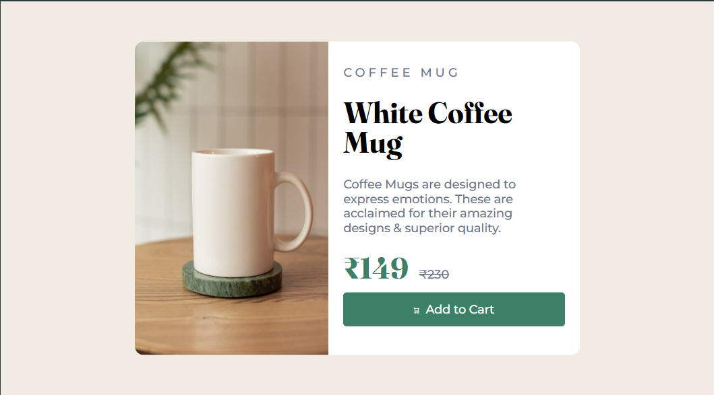

# 🛍️ Modern Product Card | CSS Grid & Flexbox



A sleek, responsive product card UI component built with pure **HTML & CSS** (Flexbox & Grid). Perfect for e-commerce websites!

## ✨ Features

✔ **Fully Responsive** - Works on mobile, tablet & desktop  
✔ **Modern UI Design** - Clean, minimalist aesthetics  
✔ **Interactive Elements** - Smooth hover animations  
✔ **Cross-Browser Compatible** - Tested on Chrome, Firefox, Safari  
✔ **Lightweight** - No frameworks or libraries

## 🚀 Live Demo

[](https://panchal-dev.github.io/Product-Card/)  
👉 **Experience it here:** [Live Demo](https://panchal-dev.github.io/Product-Card/)

## 🛠️ Installation

```bash
# Clone the repository
git clone https://github.com/Panchal-dev/Product-Card.git

# Navigate to project
cd Product-Card

# Open in browser (no build needed!)
open index.html
```
